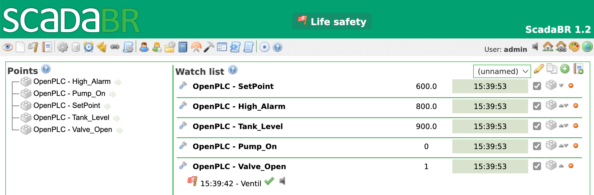
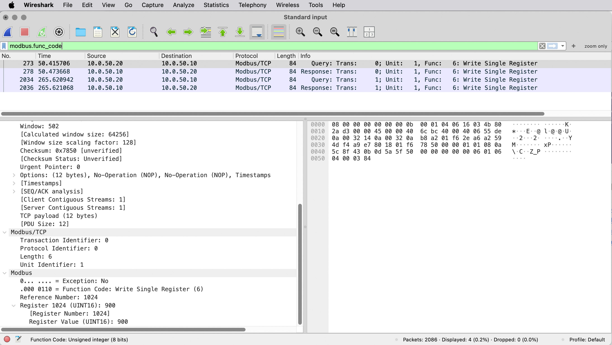

# Individuell labb 2 (ais-lab2)
Industriell säkerhetslabb med IT/OT-nätverksseparation

## Del 1: Steg 1-5

### Nyskapad Docker image
Jag testade att använda mig av bitelxux/scadabr, men fick en del problem när jag testade med den versionen. Jag är inte helt säker på att problemen hade sin härkomst från scadabr-koden, men jag fick slutligen till det när jag istället laddade hem war-filen från ScadaBR:s officiella Github-sida, och skapade en helt ny docker image. Jag använder också ”volumes” för att få ”persistent data”, dvs. att ändringar jag gör i webbgränssnittet sparas, så att de finns där när jag kör igång docker- containrarna igen.

### Problem med anslutning och javascript
I början fick jag också problem med ”java.lang.IllegalStateException: Illegal access: this web application instance has been stopped already.” Troligen berodde det på att ScadaBR försökte ansluta till MySQL-databasen innan den var redo. Och när Tomcat märker att något blir fel i anslutningen, försöker den att stänga applikationen. För att åtgärda detta lade jag till en ”health-check”, så att det går att kontrollera att en server är igång innan man försöker ansluta. Då startade alla mina containrar som de skulle.

Sedan fick jag problem med ett javascript-fel i gränssnittet för ScadaBR: ”sortSelect is not defined”. Det felet beror oftast på en saknad referens i en fil som heter dataSource.jsp. Jag kunde lösa det genom att i min Dockerfile skjuta in en rad med javascript-kod på alla html-sidor för gränssnittet.

### Mappning av variabler och ändring av värden
Jag fick upp webbgränssnitten för både Open PLC och ScadaBR. I början fick jag information i Monitoring i OpenPLC, men inga värden ändrades där, när jag gjorde ändringar i ScadaBR. Efter en hel del testande, efterforskande och felsökning så kom jag fram till att det helt enkelt inte går att få OpenPLC att registrera de ändrade värdena. De värden som syns är helt enkelt de som sätts i själva programmet.  Kanske beror det på att jag kör processerna som docker-containrar, kanske har det att göra med programkoden. Parametrarna som varv satta i lokala variabler i programkoden, gjorde att det inte gick att sätta nya värden i ScadaBR. Därför ändrade jag i programkoden så att jag definierar variablerna som externa där, och sedan har ett konfigurationsblock med globala variabler, där jag mappar de externa variablerna till specifika modbus-adresser (offsets), och sedan sätter värdena i gränssnittet för ScadaBR efter att jag fått igång containrarna och kört igång programmet på OpenPLC. Detta gäller exempelvis ”Setpoint”, som jag nu satte till en ”tom” minnesadress (%MW1), som PLC-programmet inte skriver över, utan bara läser ifrån. Därigenom kan jag påverka värdena i OpenPLC från ScadaBR, exempelvis ”Write Single Register”.

### Skapa larmhändelse i ScadaBR
Med alla justeringar enligt ovan, så kunde jag lägga till de olika datapunkterna i Watch List i ScadaBR. Jag kan också få ett larm att lösa ut, genom att ändra Setpoint till ett värde som ligger över High Alarm. Det här gör jag med Point Event Detectors, där jag ställer in den händelse som ska utlösa ett larm. I mitt fall att ventilen är öppen mer än 10 sekunder. Det här kopplar jag till en ”graphical view”, där jag kopplar olika gif-bilder till Valve_On. Om värdet är 1 (ventilen öppen), visas en röd blinkande ikon. Om värdet är 0, visas en grå ikon utan blinkning.

<kbd></kbd>

### Kontrollera trafiken med Wireshark
För att komma åt trafiken när den körs på en docker-container måste man trixa lite. På macOS finns det inget direkt bridge-gränssnitt som Wireshark kan komma åt. Detta beror på att Docker körs i en lättviktig virtuell maskin (Linux VM), vilket gör att bridge-gränssnittet är dolt inuti denna VM och inte tillgängligt direkt för macOS. Istället måste docker exekvera ett kommando som körs mot en specifik container:

docker run --rm --net=container:<container_name> nicolaka/netshoot tcpdump -U -i any -w - | wireshark -k -i -

Man kan konstatera i Wireshark att loggposterna för OpenPLC visas i klartext, att man kan se SQL-kommandon i klartext, samt hur ScadaBR skriver till ett register via modbus. En sak som är intressant är att det inte går att hitta läsningen av värden från OpenPLC i wireshark (exempelvis Read Holding Registers och Read Coils).

<kbd></kbd>
