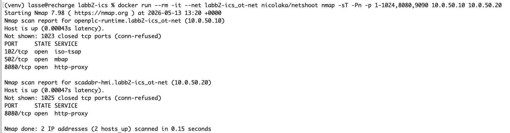

# ICS-arkitektur — Labb 2

## Kommunikationsflöden

Kommunikationen kan delas upp i två zoner: Intern OT-trafik (inuti Docker-nätverket) och Externa administrationsflöden.

### OT-Kärnflöde (Modbus TCP):
Källa: ScadaBR (10.0.50.20)
Destination: OpenPLC (10.0.50.10:502)
Beskrivning: ScadaBR frågar OpenPLC regelbundet efter registerstatus samt skickar kommandon (kan skriva värden).

### Externt HMI-flöde (HTTP):
Källa: Webbläsare (localhost)
Destination: ScadaBR-containern (10.0.50.20:8080 via host-port 9090)
Beskrivning: Operatörsgränssnitt, visning av Watch Lists och larmhantering.

### Externt PLC-adminflöde (HTTP):
Källa: Webbläsare (localhost)
Destination: OpenPLC-containern (10.0.50.10:8080 via host-port 8080)
Beskrivning: Uppladdning av PLC-program (.st-filer) och hårdvarukonfiguration.

### Internt Databasflöde (SQL):
Källa: ScadaBR (10.0.50.20)
Destination: ScadaDB (10.0.50.15:3306)
Beskrivning: Lagring av historik, taggkonfiguration och användardata.

[Docker Host Network/External Management]
       │                      │
       ├─► (Port 8080) ───────┼─► [OpenPLC Container]
       │                      │       IP: 10.0.50.10
       │                      │   ├── Port 8080 (Webb-admin, HTTP utan TLS)
       │                      │   ├── Port 502  (Modbus TCP)
       │                      │   └── Port 102  (Siemens S7/ISO-TSAP)
       │                      │
       └─► (Port 9090) ───────┼─► [ScadaBR Container]
                                      IP: 10.0.50.20
                                  └── Port 9090 (Webb-admin, HTTP utan TLS)

<kbd></kbd>

## Potentiell Attackyta
Detta är ett klassiskt industriellt upplägg (ICS/OT) som är flyttat till Docker. Därigenom ärver systemet flera fundamentala sårbarheter. Om en angripare tar sig in på Docker-hosten eller på det lokala nätverket kan det innebära dessa hot:

### 1. Okrypterad och oautentiserad Modbus TCP (Port 502)
<b>Risken:</b> Modbus TCP har ingen inbyggd kryptering eller autentisering.
<b>Attackvektor:</b> Om en angripare kan köra en container i vårt ot-nät (exempelvis genom att kompromettera ScadaBR), kan de köra script för att skicka falska Modbus-kommandon direkt till OpenPLC. De kan tvångsstarta/stoppa motorer eller manipulera sensorvärden, vilket givetvis är ett mycket allvarligt hot (Man-in-the-Middle).

### 2. Klartext-administration via HTTP (Port 8080 & 9090)
<b>Risken:</b> Både OpenPLC:s adminpanel och ScadaBR använder okrypterad HTTP istället för HTTPS.
<b>Attackvektor:</b> Inloggningsuppgifter (användarnamn med standardlösenord) och sessions-cookies skickas helt i klartext över nätverket. En angripare som avlyssnar trafiken kan enkelt stjäla administratörssessionen och ladda upp ett skadligt PLC-program, vilket kan få förödande konsekvenser.

### 3. Standardlösenord och hårdkodade uppgifter i Dockerfile
<b>Risken:</b> Dockerfile och docker-compose använder standardlösenord (root/root) för MySQL-databasen.
<b>Attackvektor:</b> Om databasporten av misstag exponeras externt, eller om en angripare tar sig in i ScadaBR-containern, är det trivialt att dumpa eller manipulera hela databasen, radera larmhistorik eller ändra användarbehörigheter.

### 4. Legacy-miljö (Java 8 och Tomcat 8.5)
<b>Risken:</b> ScadaBR kräver den gamla Java 8-miljön. Gamla versioner av Tomcat och Java har kända, publika sårbarheter (CVE:er).
<b>Attackvektor:</b> En angripare kan scanna ScadaBR-webbservern och utnyttja kända brister i Tomcat för att uppnå Remote Code Execution (RCE), vilket ger dem full kontroll över containern utan att behöva gissa lösenord.